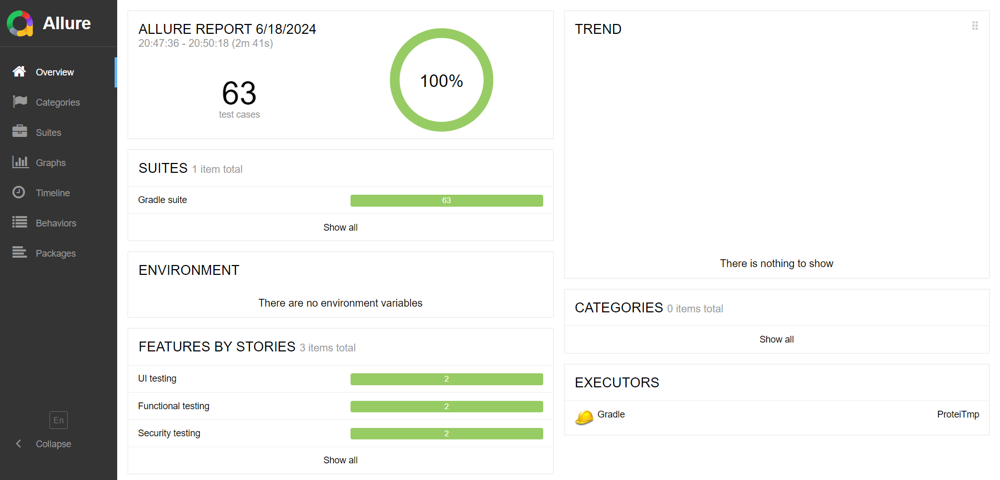
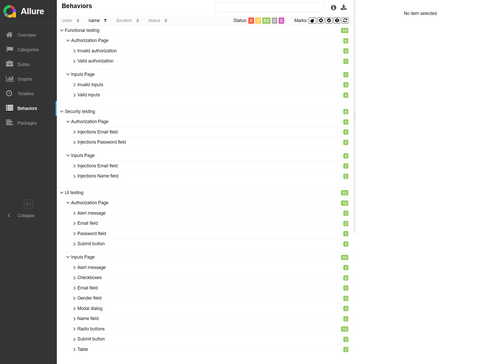

<h1>Отчет автоматизированного тестирования</h1>
<h2>Краткое описание</h2>
В ходе тестирования были реализованы тест-кейсы, на основе проверок <a href="https://docs.google.com/spreadsheets/d/1q8xd6sDxd11XxgBhMsG4IvHMhhLvpTTBOh8AXMCUXPk/edit?usp=drive_link">чек-листа</a>. Которые проверяют отображение UI элементов, основных функций страниц, авторизации.
<h2>Сведения о ходе испытаний</h2>
В процессе проведения тестирования было реализовано 63 тестовых сценария. Из них:
<ul>
    <li>Успешно пройденных - 63 или 100%.</li>
    <li>Неудачных - 0 или 0%.</li>
</ul>

Скриншот Allure Overview.
    

Скриншот Allure Behavoirs
    

<h2>Результаты испытаний</h2>
Проходит тест-кейс отлавливающий ошибку. Написан на основе баг-репорта - <a href="https://github.com/Nephedov/Protei/issues/1">"Отсутствует валидация поля ввода "Имя", на странице с формой анкеты, при вводе xss инъекции"</a>.